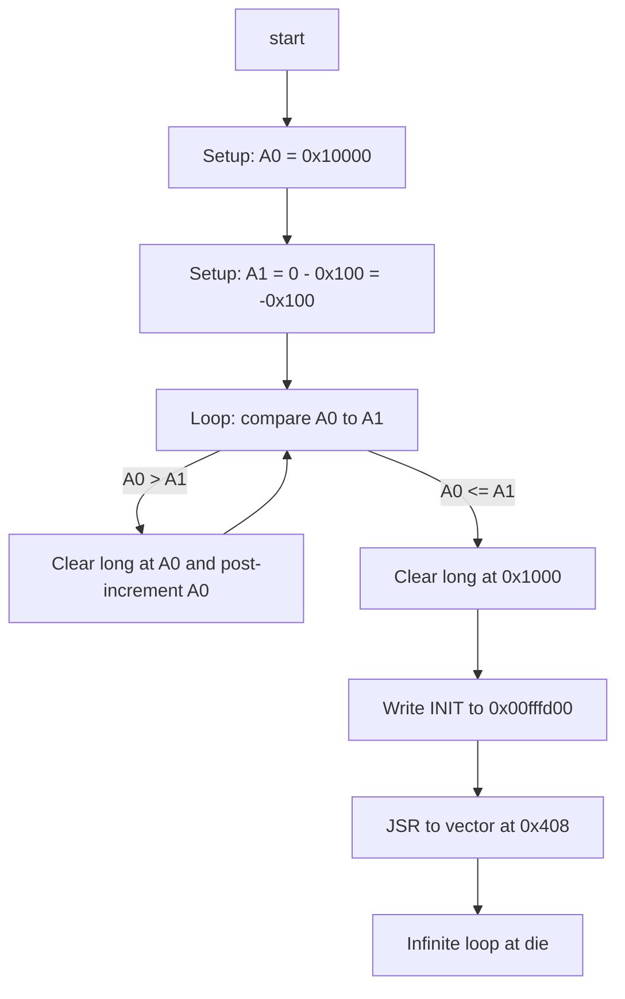

# factory
clears nvram

## Flowchart

```mermaid
flowchart TD
    A[start] --> B[Setup: A0 = 0x10000]
    B --> C[Setup: A1 = 0 - 0x100 = -0x100]
    C --> D[Loop: compare A0 to A1]
    D -->|A0 > A1| E[Clear long at A0 and post-increment A0]
    E --> D
    D -->|A0 <= A1| F[Clear long at 0x1000]
    F --> G[Write INIT to 0x00fffd00]
    G --> H[JSR to vector at 0x408]
    H --> I[Infinite loop at die]
```
